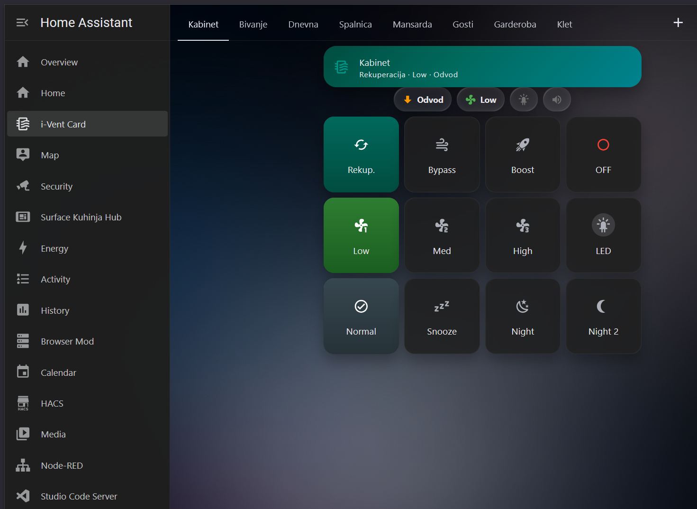
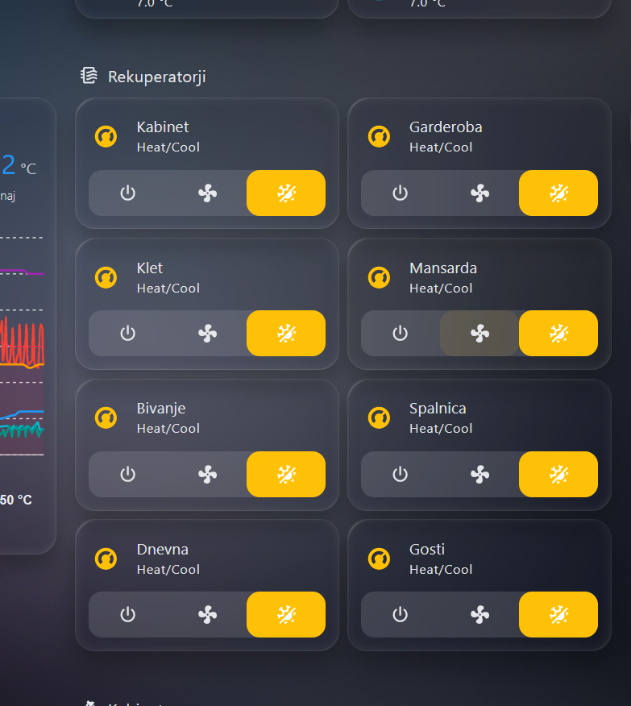
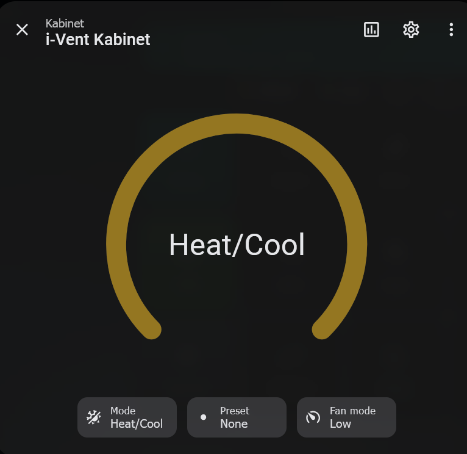
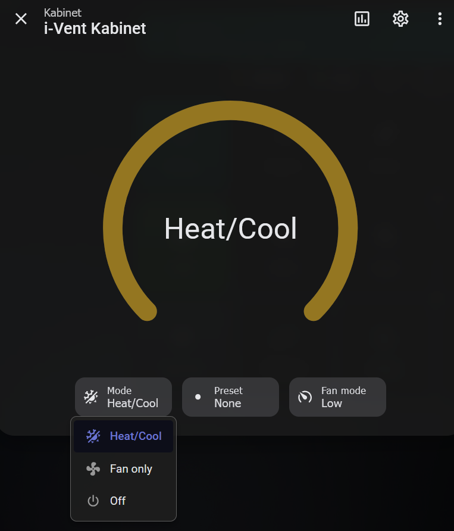
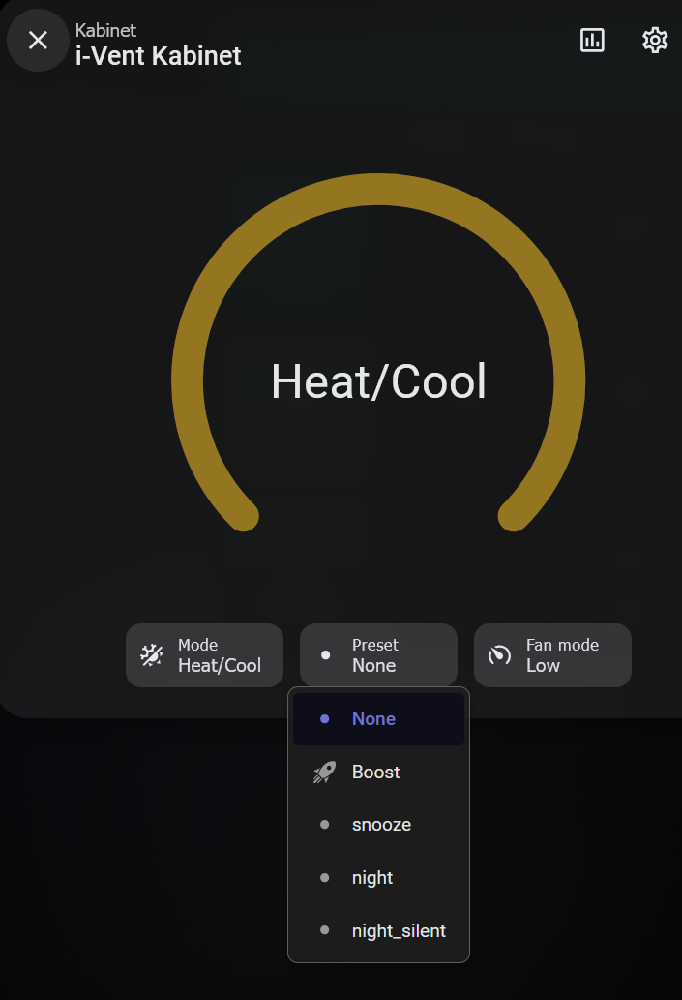
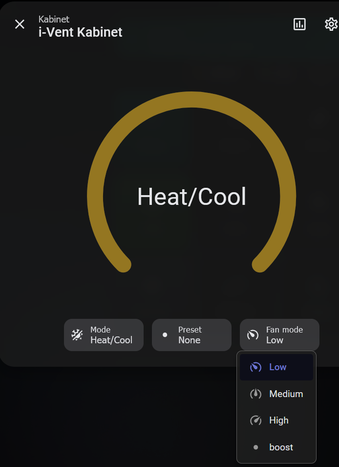

# i-Vent Rekuperator — Home Assistant Integration

Custom HACS integration for [i-Vent](https://i-vent.com/) heat recovery ventilation units via the **i-Vent Cloud API**.

## Screenshots

### i-Vent Mobile App

*Native i-Vent app showing room controls: mode (Rekuperacija/Bypass/Boost/OFF), fan speed (Low/Med/High), and presets (Normal/Snooze/Night/Night 2)*

### Home Assistant — Overview

*All 8 i-Vent units displayed in Home Assistant with power, fan, and mode controls*

### Home Assistant — Climate Card

*Climate entity with thermostat dial showing current HVAC mode*

### Home Assistant — Mode Selection

*Available HVAC modes: Heat/Cool (recovery), Fan only (ventilation), Off*

### Home Assistant — Preset Modes

*Preset modes: None, Boost, Snooze, Night, Night Silent*

### Home Assistant — Fan Speed

*Fan speed control: Low, Medium, High, Boost*

## Why This Is Useful

i-Vent recuperators have no official Home Assistant integration. This integration exposes your entire ventilation system to HA, enabling:

- **Central overview** — see all recuperators in one dashboard instead of checking each room in the i-Vent app
- **Mode control** — switch between recovery, ventilation, and off modes per room
- **Fan speed control** — set fan speed (low, medium, high, boost) per unit
- **Airflow direction** — see whether each unit is in supply (dovod) or extract (odvod) mode
- **LED and buzzer control** — toggle the LED indicator and buzzer on each unit
- **Automations** — turn on boost when cooking, switch to night mode at bedtime, lower fan when nobody's home

## Prerequisites

You need two values from the i-Vent Cloud platform:

1. **API Key** — your authentication token from [cloud.i-vent.com](https://cloud.i-vent.com)
2. **Location ID** — the numeric ID of your i-Vent installation

### How to get your API Key and Location ID

1. Log in to [cloud.i-vent.com](https://cloud.i-vent.com)
2. Open your browser's Developer Tools (F12) → Network tab
3. Navigate around the dashboard and look for API requests to `/api/v1/live/...`
4. The `Authorization: Bearer <token>` header contains your **API Key**
5. The URL path `/live/{number}/info` contains your **Location ID**

## Installation

### HACS (Custom Repository)

1. In HACS, go to Integrations → ⋮ → Custom Repositories
2. Add this repository URL, category: Integration
3. Install "i-Vent Rekuperator"
4. Restart Home Assistant
5. Go to Settings → Devices & Services → Add Integration → i-Vent
6. Enter your API Key and Location ID

### Manual

1. Copy `custom_components/ivent/` to your HA `config/custom_components/` directory
2. Restart Home Assistant
3. Go to Settings → Devices & Services → Add Integration → i-Vent
4. Enter your API Key and Location ID

## Entities

Each i-Vent unit (group) creates the following entities:

| Platform | Entity | Description |
|----------|--------|-------------|
| `climate` | i-Vent {name} | HVAC mode (recovery, ventilation, off), fan speed, presets |
| `fan` | {name} Ventilator | Fan on/off and speed control (low/medium/high/boost) |
| `sensor` | {name} Smer pihanja | Airflow direction (Dovod / Odvod) |
| `switch` | {name} LED | LED indicator on/off |
| `switch` | {name} Buzzer | Buzzer on/off |

## Roadmap

- [ ] **Local UDP sensors** — add temperature, humidity, and filter sensors via local UDP protocol (no cloud needed)
- [ ] **Multi-location support** — allow multiple i-Vent locations in a single HA instance
- [ ] **HACS default repository** — submit to HACS default repo once stable

## License

MIT
